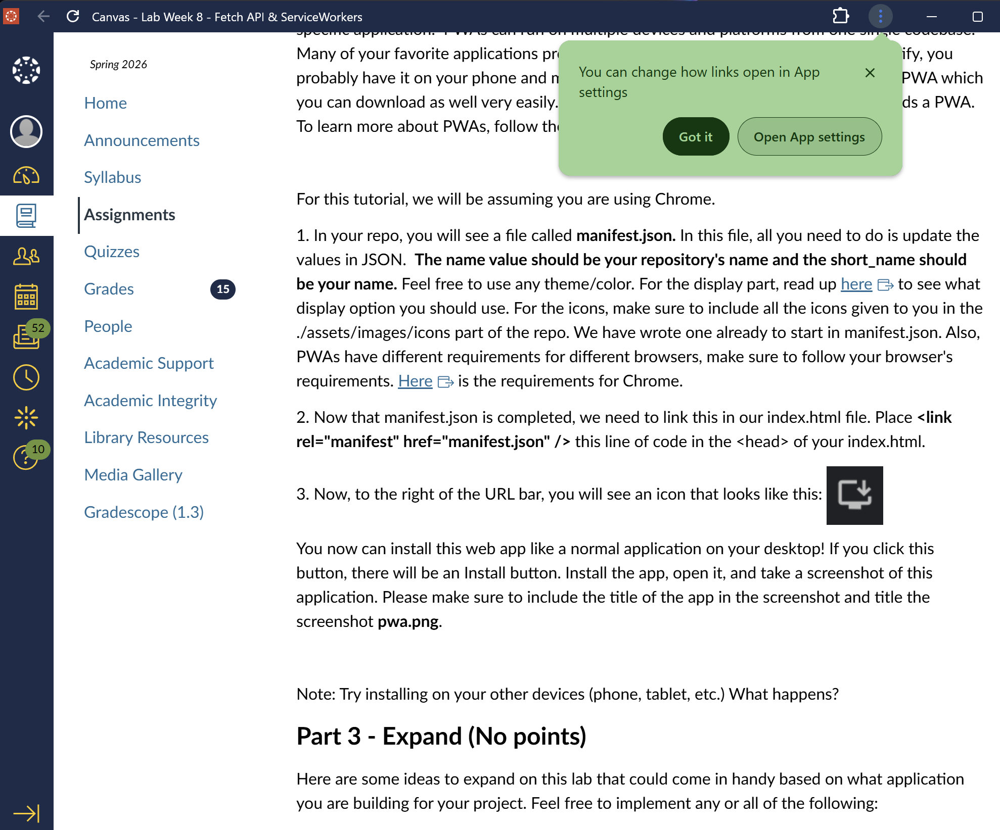

# Lab8-Starter
Alec Lichtenberger
https://aleclichtenberger.github.io/Lab8_Starter/
Graceful degradation and service workers are closely related because service workers are a practical tool for implementing graceful degradation in web apps. Service workers allow the app to degrade gracefully when network connection is slow or absent by falling back onto existing cached content. This means users who may not have access to all the technology and access we have can still somewhat reliably access and interact with content even with low network access.

